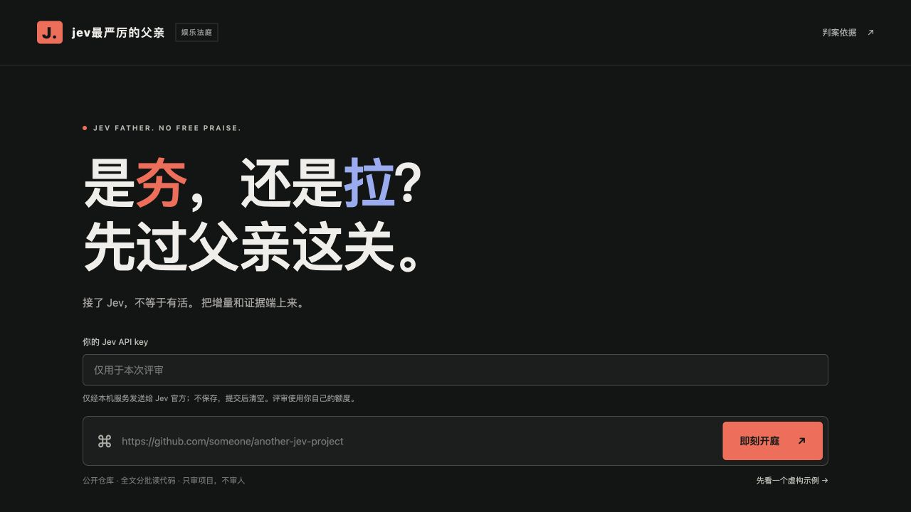

# jev最严厉的父亲

**jev-father：用 Jev 评价基于 Jev 的项目。不给鼓励分，只审项目，不审人。**

能跑只是起点，手速不等于创新。输入公开 GitHub 仓库链接，看它是用在刀刃上，还是强行蹭热度。全文分批审阅、保留正反依据，最后由 Jev Choice 在 **夯 / 顶级 / 人上人 / NPC / 拉** 中落锤。

## 让 Coding Agent 装好

把这段话发给 **Codex 或 Claude Code**：

> 帮我安装并启动这个项目，打开本地网页：https://github.com/Nplace-su/jev-father

Agent 会处理环境、启动本地服务并打开浏览器。你只需要填 **Jev API key + 公开仓库链接**。

Key 仅用于本次评审，经你自己的本地服务发送给 Jev 官方，不保存、不发给作者。无需注册我们的账号，也无需部署云服务器。

给 Coding Agent 的入口

读取 [AGENTS.md](AGENTS.md)。Node.js 20.12+，零依赖；`npm run start:agent` 自动选择本地端口、启动后台服务并返回已验证的网址。Claude Code 也可从 [CLAUDE.md](CLAUDE.md) 进入同一流程。

[评审规则与实现细节](docs/harness.md) · [Jev Choice](https://docs.typesafe.ai/primitives/choice)

免责声明：仅供娱乐，请勿用于任何严肃用途。
